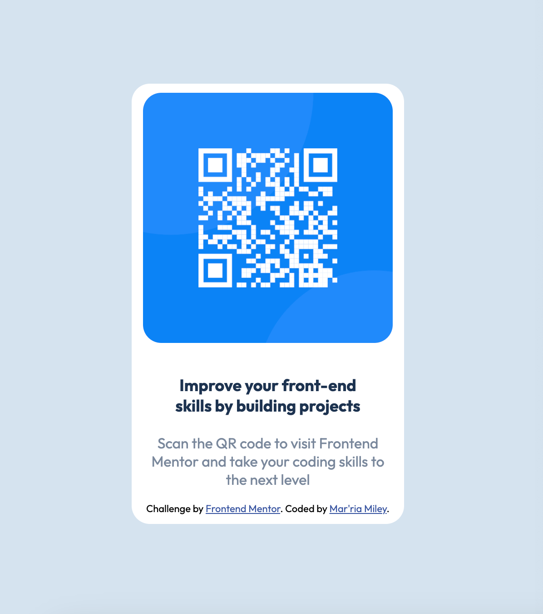

# Frontend Mentor - QR code component solution

This is a solution to the [QR code component challenge on Frontend Mentor](https://www.frontendmentor.io/challenges/qr-code-component-iux_sIO_H). Frontend Mentor challenges help you improve your coding skills by building realistic projects.

## Table of contents

- [Overview](#overview)
  - [Screenshot](#screenshot)
  - [Links](#links)
- [My process](#my-process)
  - [Built with](#built-with)
  - [What I learned](#what-i-learned)
  - [Continued development](#continued-development)
  - [Useful resources](#useful-resources)
- [Author](#author)
- [Acknowledgments](#acknowledgments)

**Note: Delete this note and update the table of contents based on what sections you keep.**

## Overview

### Screenshot

### Links

- Solution URL: [Add solution URL here](https://your-solution-url.com)
- Live Site URL: [Add live site URL here](https://your-live-site-url.com)

## My process

### Built with

- Semantic HTML5 markup
- CSS custom properties

### What I learned

This was my first completely independent project outside of my bootcamp courses, I had to work through exactly how I wanted to breakdown this project and it only made sense to start with the html. Through this once I moved to the css next it was easy to understand why planning ahead and making clear classes at the same time as writing html is a lot more useful than having to go back and forth to put them in later. When trying to figure out how to resize a container I was using the padding element and that of course was not correct, which led me to searching it up on MDN Web Docs.

### Continued development

Moving forward I would like to just work on more projects to perfect my process and find a layout that I like using. I would definitely like to work more with custom css properties and design features. Also this project vwas my first time using Github so I would like to expand on my knowledge on that platform as well since I can see how useful it is when sharing code in teams.

### Useful resources

- [MDN Web Docs](https://developer.mozilla.org/en-US/docs/Learn/CSS/Building_blocks/Sizing_items_in_CSS) - When I hit a wall with how to resize a container in order to make my design match the original, I visited this site to help me understand. Everything was explained in plain english and also in code, I highly recommend this resource to anyone having issues.

## Author

- Frontend Mentor - [@marriamm-96](https://www.frontendmentor.io/profile/marriamm-96)

## Acknowledgments

The knowledge that I have been obtaining during my time in the SheCodes Max program has absolutely helped me understand code in a way that has been easy and felt natural. Through their workshops I have discovered my passion for coding and I am forever grateful for that discovery.
